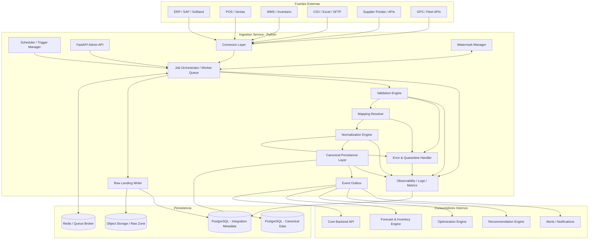

# SotA — Ingestion Service

## Respuesta puntual sobre el punto 4.3: ¿la normalización se haría con IA + validación humana?

**Sí, pero no como mecanismo principal del pipeline operativo.**

La conversión del dato externo al modelo canónico de SotA (**Validation & Normalization Layer**) no debería depender principalmente de IA generativa. El diseño correcto es:

- **Reglas determinísticas + mappings configurables** como base
- **IA asistiva** solo para acelerar onboarding, sugerir equivalencias o resolver ambigüedades
- **Validación humana** al momento de configurar o ajustar mappings sensibles

### Qué sí haría la IA

Durante onboarding o expansión de una integración, la IA puede ayudar a:

- sugerir correspondencia entre campos del sistema origen y el modelo canónico de SotA
- inferir equivalencias de nombres poco estandarizados
- detectar posibles columnas candidatas para SKU, branch, stock, lead time, supplier, etc.
- proponer normalización de unidades, monedas o estados documentales
- levantar alertas de inconsistencias semánticas

Ejemplos:

- `COD_ART`, `ITEM_CODE`, `SKU_ID`, `MATERIAL` → probable `sku_external_id`
- `BOD`, `SUC`, `LOCAL`, `WH_CODE` → probable `location_external_id`
- `STOCK_ACT`, `QTY_AVAIL`, `LIBRE` → probable `quantity_on_hand`

### Qué no haría la IA sola

No dejaría que la IA:

- publique datos normalizados directamente en tablas canónicas sin control
- tome decisiones finales sobre mappings críticos sin revisión
- resuelva sola conflictos de identidad de SKU/proveedor/sucursal
- modifique reglas de negocio en producción sin aprobación

## ¿Eso se hace una sola vez en onboarding?

**No. Se hace fuerte al inicio, pero no es un evento único.**

La mayor carga de trabajo ocurre en el **onboarding inicial**, donde se define:

- conexión a la fuente
- objetos/tablas/endpoints a consumir
- mappings campo a campo
- reglas de validación
- equivalencias de catálogos
- políticas de incremental load

Pero luego sigue existiendo mantenimiento porque en la práctica cambian cosas:

- el ERP agrega columnas o cambia nombres
- aparecen nuevos tipos de documento
- se crean nuevas sucursales o bodegas
- cambia el catálogo de proveedores
- se incorporan nuevos datasets
- el cliente corrige maestros o reestructura códigos

Entonces la conversión tiene dos etapas:

### 1. Onboarding inicial

Se diseña y valida la integración base. Aquí sí tiene mucho sentido usar **IA como copiloto de mapeo** con **aprobación humana**.

### 2. Operación continua

Una vez aprobado, el pipeline opera con mappings persistidos y reglas determinísticas. La IA pasa a un rol secundario:

- detectar anomalías en nuevas cargas
- sugerir ajustes cuando falla una validación
- apoyar incorporación de nuevos campos/datasets

En resumen:

- **no** es algo que “hace la IA cada vez”
- **sí** es algo que se configura inicialmente
- **sí** puede requerir mantenimiento posterior
- **sí** conviene tener una capa de revisión humana al menos en onboarding y cambios estructurales

## Recomendación de diseño para SotA

Yo implementaría este patrón:

### Durante onboarding

- conector extrae muestra representativa de datos
- motor asistivo analiza esquema/headers/valores
- propone mappings al modelo canónico
- usuario técnico o implementador revisa y aprueba
- SotA guarda el mapping versionado

### En producción

- el pipeline usa solo mappings aprobados
- si aparece un campo nuevo o conflicto semántico, el job queda en estado de observación o error parcial
- se genera sugerencia asistida por IA para ajuste
- un operador técnico revisa y publica nueva versión del mapping

---

# Opción recomendada: Ingestion Service en Python

## Por qué Python

Para SotA, la opción más sólida para el Ingestion Service es **Python**, porque esta capa no solo mueve datos: también hace validación, transformación, enriquecimiento, detección de cambios y preparación para motores analíticos.

Python encaja mejor que un backend tradicional cuando hay que trabajar con:

- datasets heterogéneos
- parsing de archivos
- transformaciones tabulares
- reglas de validación complejas
- cálculos sobre fechas, lead times y movimientos
- cercanía técnica con forecasting, optimization y data processing

## Stack sugerido

- **FastAPI** para endpoints administrativos y operativos
- **Celery** o workers equivalentes para jobs asíncronos
- **Redis** como broker y soporte de colas
- **PostgreSQL** para metadata técnica, estado de jobs y zona canónica
- **S3/object storage** para raw payloads y archivos grandes
- **Polars** o **pandas** para transformación de datos
- **SQLAlchemy** para persistencia
- **Pydantic** para contratos y validaciones

## Responsabilidades del servicio

- conectarse a fuentes externas
- extraer datasets relevantes
- guardar payload raw
- validar estructura y contenido
- transformar al modelo canónico de SotA
- persistir datos normalizados
- emitir eventos internos para recalcular recomendaciones, alertas y motores
- registrar observabilidad y trazabilidad completa

---

# Diagrama de componentes — Ingestion Service

---

# Lectura del diagrama

## 1. Entradas

El servicio recibe información desde múltiples sistemas externos:

- ERP
- POS
- WMS
- archivos
- portales/APIs de proveedores
- sistemas logísticos

Cada fuente se ataca a través de un **Connector Layer**, no directamente desde la lógica de negocio.

## 2. Activación

Los procesos de ingesta pueden dispararse por:

- scheduler
- ejecución manual desde API administrativa
- eventos externos
- reintentos automáticos

## 3. Raw landing

Antes de transformar, el payload se guarda en una **raw zone** para trazabilidad, replay y debugging.

## 4. Validación + mapeo + normalización

Esta es la capa más importante del servicio.

Se ejecuta en esta secuencia:

1. **Validation Engine** revisa esquema, tipos, campos obligatorios y consistencia básica.
2. **Mapping Resolver** convierte campos del origen a campos canónicos usando mappings aprobados.
3. **Normalization Engine** aplica estándares de unidades, fechas, monedas, estados y estructuras.

## 5. Persistencia canónica

Una vez limpio, el dato se persiste en las tablas canónicas de SotA.

## 6. Publicación de eventos

Cuando un dataset queda cargado, el servicio publica eventos internos para que otros motores reaccionen.

Ejemplos:

- recalcular forecast
- recalcular recomendaciones de compra
- recalcular recomendaciones de traslado
- gatillar alertas
- invalidar cache operacional

## 7. Manejo de errores

Los errores no deben destruir el pipeline completo. Los registros conflictivos se aíslan y se dejan auditables.

## 8. Watermarks

El servicio mantiene estado incremental por fuente y dataset, evitando recargas completas innecesarias.

---

# Componentes clave del Ingestion Service

## 1. Scheduler / Trigger Manager

Dispara jobs por calendario, manualmente o por eventos.

Ejemplos:

- stock cada 15 minutos
- ventas cada hora
- catálogos cada noche
- órdenes de compra cada 2 horas

## 2. Connector Layer

Abstrae la forma de conexión con cada sistema fuente.

Cada conector sabe:

- autenticación
- endpoints/tablas/archivos
- paginación
- incremental load
- manejo de errores específicos

## 3. Job Orchestrator / Worker Queue

Administra la ejecución asíncrona de jobs, reintentos y concurrencia.

## 4. Raw Landing Writer

Guarda el payload original y metadata de extracción.

## 5. Validation Engine

Aplica reglas de esquema y reglas básicas de negocio.

## 6. Mapping Resolver

Resuelve el paso desde el esquema del cliente al esquema canónico de SotA.

Aquí es donde puede existir **IA asistiva con aprobación humana**, sobre todo en onboarding y cambios estructurales.

## 7. Normalization Engine

Convierte el dato a estándares comunes:

- unidades
- fechas
- monedas
- identificadores
- nombres de estados

## 8. Canonical Persistence Layer

Escribe los datos limpios en tablas utilizables por el resto del sistema.

## 9. Event Outbox

Publica eventos internos de forma confiable después de la persistencia.

## 10. Error & Quarantine Handler

Aísla registros problemáticos, permite inspección y evita que falle toda la corrida.

## 11. Watermark Manager

Administra el punto de continuidad de las cargas incrementales.

## 12. Observability Layer

Centraliza logs, métricas, trazas y estado de salud de conectores/jobs.

---

# Recomendación final para SotA

La forma correcta de implementar esta parte es:

- **Python como stack principal del servicio**
- **mappings aprobados y versionados** como base de conversión
- **IA como copiloto de onboarding y mantenimiento**, no como motor autónomo de normalización en producción
- **validación humana** al menos para el set inicial y cambios estructurales
- **raw zone + canonical zone + event outbox** como patrón base
- **jobs batch incrementales** como estrategia inicial

En términos prácticos:

> La normalización no debería ser una decisión continua tomada por IA en cada corrida, sino una capacidad configurada, auditada y gobernada, donde la IA ayuda a proponer mappings y detectar anomalías, mientras que la operación productiva corre sobre reglas y mappings ya aprobados.
